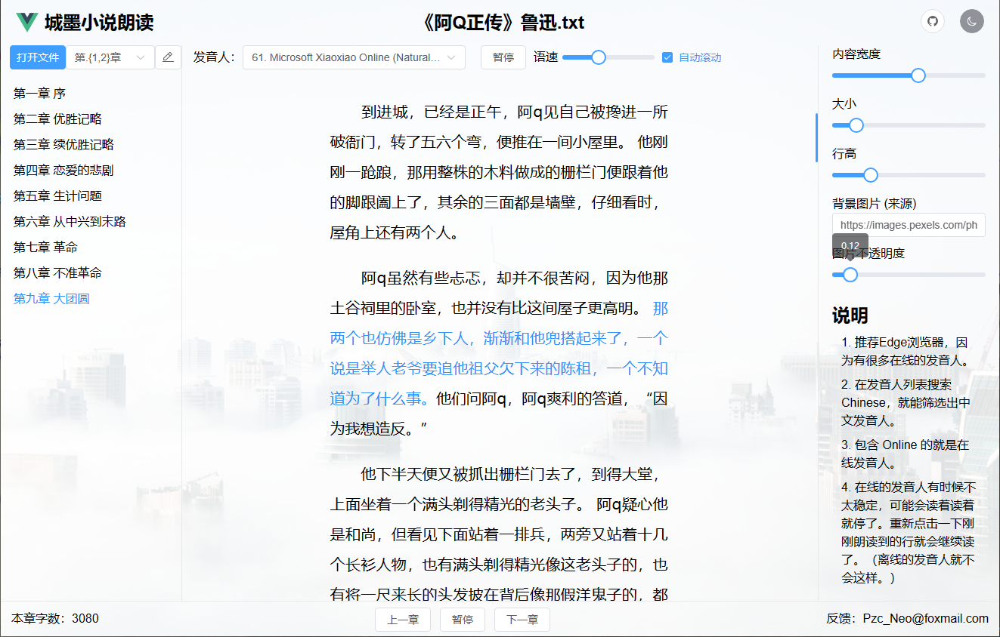
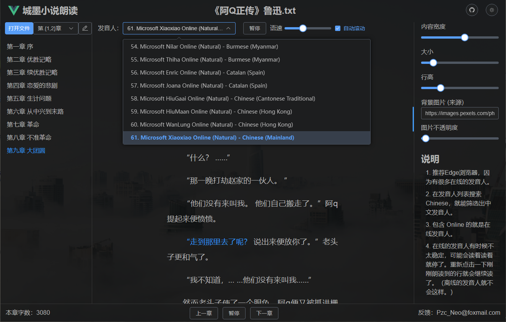
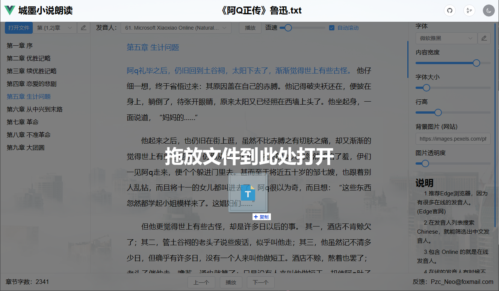

# 城墨小说朗读

## 介绍

这是一款基于 Vue 的小说朗读应用，主要功能有：

- 章节切割
- 朗读记录保存
- 样式设置

## 预览

可打开网站体验：[https://tts.neoweb.top](https://tts.neoweb.top)







## 开发

```bash
# 0. 克隆项目
git clone https://github.com/Pzc-Neo/vue-web-reader.git

# 1. 安装依赖
pnpm install

# 2. 启动项目
pnpm dev

# 3. 构建项目
pnpm build
```

## 其他

图标网址：<https://icon-sets.iconify.design/carbon>

IndexedDB 相关：<https://developer.mozilla.org/en-US/docs/Web/API/Storage_API/Storage_quotas_and_eviction_criteria>
